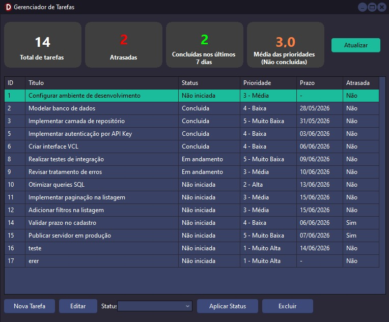

# Sistema de Gerenciamento de Tarefas

## Observação técnica — ADO em vez de FireDAC

O ideal para o projeto seria o uso de FireDAC, porém minha licença do Delphi é a Professional e o driver link do FireDAC para SQL Server (`TFDPhysMSSQLDriverLink`) só está disponível nas edições **Enterprise** e **Architect**.
Para contornar o problema, adotei a conexão via `TADOConnection` (`Data.Win.ADODB`), que acessa o SQL Server pelo provedor **MSOLEDBSQL** nativo do Windows, sem dependências externas.

---

Aplicação VCL em Delphi composta por dois projetos independentes:

- **Servidor** (`servidor/`) — serviço REST em console que acessa o banco de dados
- **Cliente** (`cliente/`) — interface VCL desktop que consome o serviço via HTTP

## Demonstração



---

## Pré-requisito: criar o banco de dados

> **Execute este passo antes de qualquer outra coisa.** O servidor não inicia sem o banco criado.

1. Abra o **SQL Server Management Studio (SSMS)** e conecte em `localhost` com Windows Authentication
2. Abra o arquivo `servidor/database/schema.sql`
3. Clique em **Execute** (ou pressione **F5**) — o script cria o banco `TarefasDB`, a tabela `Tarefas` e insere dados de exemplo

> Para recriar o banco do zero (ex.: após mudanças no schema), basta rodar o script novamente — ele apaga e recria a tabela automaticamente.

---

## Configuração do servidor

Copie o arquivo de exemplo e preencha:

```
copy servidor\config.ini.example servidor\config.ini
```

Conteúdo mínimo para rodar localmente:

```ini
[Database]
Server=.
Database=TarefasDB
Trusted_Connection=True

[Server]
Port=9000

[Security]
ApiKey=dev-api-key-12345
```

## Configuração do cliente

Copie o `config.ini` para a pasta do executável:

```
copy cliente\config.ini cliente\Win64\Debug\
```

Conteúdo:

```ini
[Server]
Url=http://localhost:9000
ApiKey=dev-api-key-12345
```

---

## API REST

Todas as rotas exigem o header `X-API-Key` com a chave configurada no servidor.

| Método | Rota | Descrição |
|---|---|---|
| GET | `/tasks` | Lista todas as tarefas |
| POST | `/tasks` | Cria uma nova tarefa |
| PATCH | `/tasks/:id` | Atualiza campos da tarefa (título, descrição, prioridade, prazo e/ou status) |
| DELETE | `/tasks/:id` | Remove uma tarefa |
| GET | `/stats` | Retorna estatísticas consolidadas |

### Criar tarefa

```http
POST /tasks
X-API-Key: dev-api-key-12345
Content-Type: application/json

{
  "titulo": "Nova tarefa",
  "descricao": "Descrição opcional",
  "prioridade": 3,
  "dataPrazo": "2026-12-31T00:00:00"
}
```

### Editar tarefa

```http
PATCH /tasks/1
X-API-Key: dev-api-key-12345
Content-Type: application/json

{
  "titulo": "Título atualizado",
  "descricao": "Nova descrição",
  "prioridade": 2,
  "dataPrazo": null
}
```

### Atualizar status

```http
PATCH /tasks/1
X-API-Key: dev-api-key-12345
Content-Type: application/json

{
  "status": "Concluida"
}
```

Valores válidos para `status`: `Não iniciada`, `Em andamento`, `Concluida`

---

## Estrutura de dados

As informações das tarefas são armazenadas em uma única tabela `dbo.Tarefas` no SQL Server:

| Campo | Tipo | Obrigatório | Descrição |
|---|---|---|---|
| `ID` | `INT IDENTITY` | — | Chave primária, gerado automaticamente |
| `Titulo` | `VARCHAR(200)` | Sim | Título da tarefa |
| `Descricao` | `VARCHAR(MAX)` | Não | Descrição detalhada (pode ser NULL) |
| `Status` | `VARCHAR(20)` | Sim | Estado da tarefa: `Não iniciada`, `Em andamento` ou `Concluida` |
| `Prioridade` | `INT` | Sim | Escala de 1 (Muito Alta) a 5 (Muito Baixa); padrão: 1 |
| `DataCriacao` | `DATETIME` | — | Preenchido automaticamente pelo banco (DEFAULT GETDATE()) |
| `DataConclusao` | `DATETIME` | Não | Preenchido automaticamente quando o status muda para `Concluida`; NULL caso contrário |
| `DataPrazo` | `DATETIME` | Não | Prazo para entrega; NULL significa sem prazo definido |

A coluna `Atrasada` é calculada em tempo de execução: uma tarefa está atrasada quando `DataPrazo IS NOT NULL AND DataPrazo < GETDATE() AND Status <> 'Concluida'`.

O banco aplica as seguintes constraints:
- `CK_Tarefas_Status` — garante que apenas os três status válidos sejam gravados
- `CK_Tarefas_Prioridade` — garante que a prioridade fique entre 1 e 5

O script completo de criação está em `servidor/database/schema.sql`.

---

## Estrutura do projeto

O projeto é composto por dois subprojetos principais: o **Servidor** (API REST em console) e o **Cliente** (Interface VCL desktop).

### Servidor (`servidor/`)

```
servidor/
├── database/
│   └── schema.sql                  Script de criação do banco
├── Infra/
│   ├── Config.pas                  Leitura do config.ini
│   └── Database.Connection.pas     Fábrica de conexão ADO
├── Model/
│   └── Model.Task.pas              Entidades TTask e TTaskStats
├── Repository/
│   ├── Repository.Interfaces.pas   Interface ITaskRepository
│   ├── Repository.SQLServer.pas    Implementação SQL Server via ADO
│   └── Repository.Factory.pas      Factory Method
├── Controller/
│   └── Controller.Tasks.pas        Handlers HTTP e middleware de segurança
├── config.ini                      Configuração local (não versionado)
├── config.ini.example              Template de configuração
└── Servidor.dpr
```

### Cliente (`cliente/`)

```
cliente/
├── uClientConfig.pas               Leitura do config.ini do cliente
├── uApiClient.pas                  Cliente HTTP (TNetHTTPClient)
├── uMain.pas / .dfm                Tela principal com grid e estatísticas
├── uTaskForm.pas / .dfm            Formulário de nova/edição de tarefa
├── config.ini                      Configuração do cliente
└── Cliente.dpr
```
